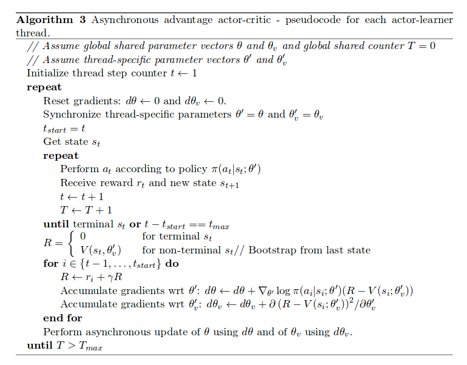

# A3C (Asynchronous Advantage Actor Critic)

Paper: https://arxiv.org/pdf/1602.01783v1.pdf

1. Run the main file:    `python main.py`

2. To customize, change the `params.py` file.

```
#these are tested
use_model='a3c' #a2c,a3c
mode='test' #test, train
env_name="CartPole-v0" #CartPole-vO
use_net='fc_1' #for CartPole, 'lenet' for breakout

```

3. TF Records are created in folder `graphs/results`

4. During testing a video is recorded automatically and saved in .tmp/(env_name)/(use_model)/ . Similarly the checkpoint is saved in this directory.

5. When using human_agent, install keyboard module and use up arrow (fire, to start) and side arrows to move sidewise. And run the program as sudo `sudo python main.py`

#### Status: 

Feature Detection needs to be done.

Image stacking needs to be done (otherwise it will be one to many mapping).
